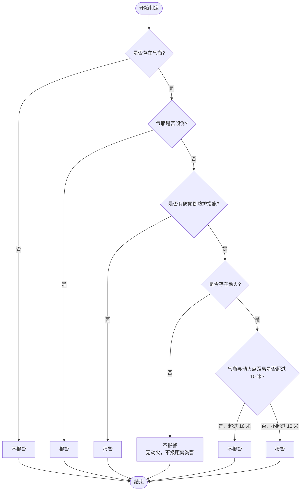

# 气瓶 / 动火 / 距离 报警判定流程

本文档描述监控逻辑的决策顺序：**无气瓶则不报警**；**无动火则不触发与距离相关的报警**；有气瓶时先判**倾倒**与**防护措施**，再结合**动火**与**10 米距离**判定是否报警。

---

## 流程图（Mermaid）

---

## 文字规则摘要

| 条件 | 结果 |
|------|------|
| 无气瓶 | 不报警 |
| 有气瓶且已倾倒 | 报警 |
| 有气瓶未倾倒，且无防倾倒措施 | 报警 |
| 有气瓶未倾倒，且有防护措施，且无动火 | 不报警（不涉及距离警） |
| 有气瓶未倾倒，且有防护措施，且有动火，距离 **≤ 10 m** | 报警 |
| 有气瓶未倾倒，且有防护措施，且有动火，距离 **> 10 m** | 不报警 |

---

## 说明

- **防倾倒措施**：指防止气瓶倾倒的防护（如固定架、防倒链等），需与业务定义一致。
- **距离**：指气瓶与动火点之间的空间距离，阈值 **10 米** 可按规范调整。
- 若在其它工具中渲染 Mermaid，可使用 VS Code 插件、GitHub/GitLab 预览或 [Mermaid Live Editor](https://mermaid.live)。
